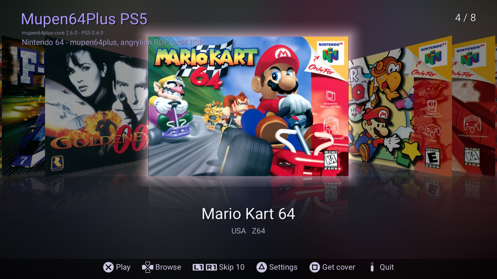

# Mupen64Plus PS5

**mupen64plus-core 2.6.0, the Nintendo 64 emulator, as a native PS5 home-screen app** for jailbroken consoles:
a game shelf with box art, DualSense support with rumble, save states, and the x86-64 dynarec, so games like
GoldenEye 007 and Donkey Kong 64 run at full speed.



Title ID `PPSA99064`. No games are included: use ROMs you dumped yourself.

## Install

Requirements: a jailbroken PS5 with **kstuff** (or kstuff-lite), **ShadowMountPlus**, and an **ELF loader**
running (elfldr, etaHEN or PS5 Payload Manager's: the usual setup).

1. Download `PPSA99064.zip` from the [latest release](../../releases/latest).
2. Copy the `PPSA99064` folder to `/data/homebrew/` on the console (FTP...), or to `homebrew/` on an exFAT
   USB drive. ShadowMountPlus adds **Mupen64Plus PS5** to the home screen.
3. Put your ROMs (`.z64 .n64 .v64 .rom`, zipped or not) in `/data/mupen64plus/roms`, or in `mupen64plus/roms`
   on a USB drive.

Nothing to send by hand: when the app starts, it sends the helper built into `eboot.bin` to the ELF loader,
which lets it out of its sandbox (`/data`, USB drives, executable memory for the dynarec).

## Updates

The app checks this repository's latest release each time it starts. When a newer one exists it downloads
`PPSA99064.zip`, checks it against the SHA-256 GitHub publishes for it, and asks:
**✕ Update now / ○ Later**. On ✕ it writes the new files over its own folder and restarts. Saves, states,
covers and settings in `/data/mupen64plus` are kept. **Settings → Check for updates** turns the question off.

## Documentation

[ps5/README.md](ps5/README.md): controls, settings, folders, how the port works, and building.

## Building and releasing (Windows + WSL Ubuntu 24.04)

```
build-native.bat              build-native\PPSA99064\ + PPSA99064.zip (+ .debug.elf)
build-native.bat Ffpfsc       also a compressed .ffpfsc image
release.bat                   build and publish a GitHub release
```

Releasing:

1. Raise `VERSION` in `ps5/Makefile`, and set the matching `contentVersion` in `ps5/app/sce_sys/param.json`
   (0.7.0 → `00.007.000`; the build stops if they differ). That number is also the release tag.
2. Write `release-notes/<contentVersion>.md`: a few short lines, shown on the console in the update question.
3. Commit and push, then run `release.bat`. It builds, creates the release with `PPSA99064.zip`, and checks
   GitHub's digest against the local zip.

Never reuse or lower a version.

## Repository layout

- `mupen64plus-core/`: the original core source, **unmodified**.
- `ps5/`: the port (plugins, PS5 layer, frontend, build).
- `release-notes/`: one file per release.

## License

GPL-3.0 ([LICENSE](LICENSE)). The parts and their licenses are listed in
[THIRD_PARTY_NOTICES.md](THIRD_PARTY_NOTICES.md).
